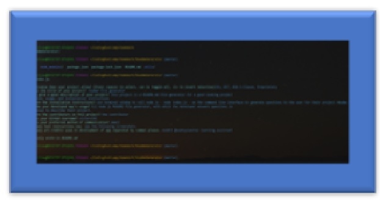

   
   
 
   # genreator 

   # Licence
  
  >  []
    
  ### :octocat:
  ### node js :package: 
  
  # Table of Contents
  <!-- toc -->
  * [Description](#description)
  * [Installation](#installation)
  * [Usage](#usage)
  * [Contributors](#contributors)
  * [GitHub Information](#github-information)
  * [Questions](#questions)
  * [Credits](#credits)
   <!-- toc stop -->

  # **Description**
    
   > description

  ## **Installation**
    
  * install

  ## **Usage**
   
    * use on CLI

  ### **Contributors**   
    * UNC trilogy me

  ## **GitHub Information**
 
  # '''' https://github.com/victorsc45 ''''

  Picture of Developer: 

    
  
  ## *Questions*
    > questions or comments contact me:
    > **email**
     **victorlitzau+github@gmail.com**

  ## See screen shots below
    > see screenshot

    
    
  ### Credits
  
   * https://github.com

      

