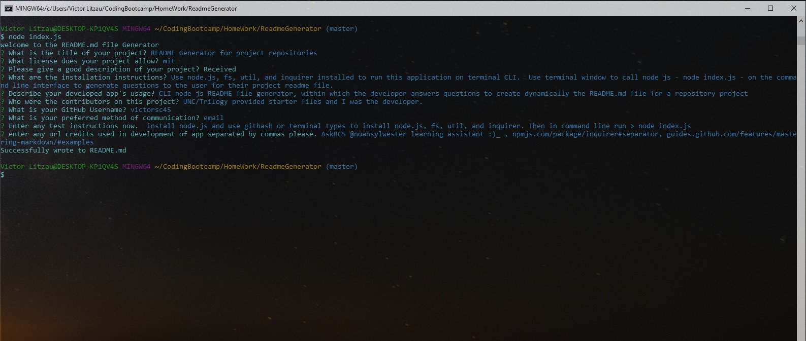

  # README Generator for GitHub Project Repositories

   # Licences
   >
   
    
 

  # **Description**
   - 
   > This project was created to help developers quickly and easily generate README.md files for their project repository.
This application can only be used in terminal or gitbash terminal types that have node js installed. Run this project 
from the CLI: using key-word ***node*** followed by a ***space*** and then ***index.js*** involking a series of questions that generate
a good README.md file.

  ## **Installation**
    -
  *  use terminal window to call node js - node index.js - on the command line interface to generate questions to the user for their project readme file.

  ## **Usage**
    -
    * CLI node js README file generator, with which the developer answers questions in

  ### **Contributors**
    -
    * undefined

  ## **GitHub Information**
  -
  # '''' https://github.com/victorsc45 ''''

  *Picture of Developer: 

    https://avatars0.githubusercontent.com/u/20911070?s=400&u=5559b53c96fd67717f991289bcc85bbb64c57f97&v=4
  
  ## *Contact me by*
  -
    * undefined 

  ## ** See screen shots below**
    >  see the following screenshots

    
    
  ### credited urls
  
   *   "AskBCS @noahsylwester learning assistant :)_",  npmjs.com/package/inquirer#separator, guides.github.com/features/mastering-markdown/#examples

      

